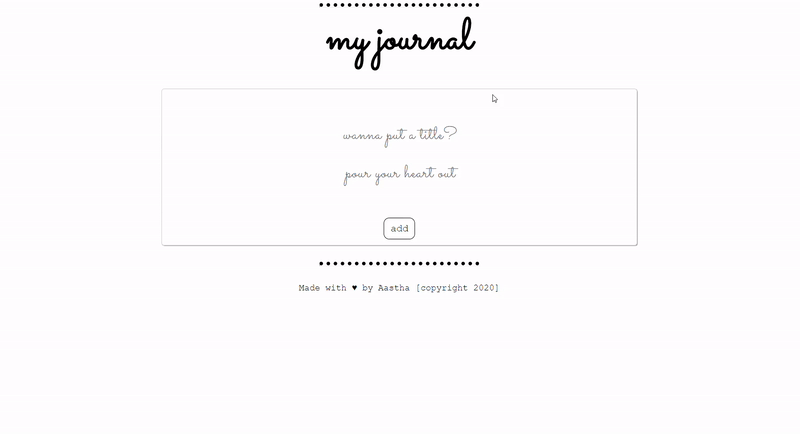

# JOURNAL

#### A simple ReactJS web app to save your diary entries on the go. You can select colour, add, edit and delete entries which are stored on the browser.

This project was bootstrapped with [Create React App](https://github.com/facebook/create-react-app).

#### SetUp on local

- Clone the project

- In the project directory, you can run: `npm start` to start the server on localhost:3000  (The page will reload if you make edits. 
  You will also see any lint errors in the console.)
